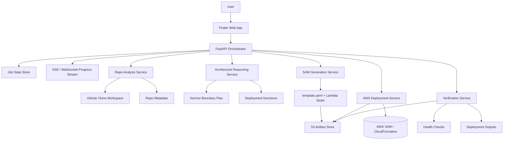
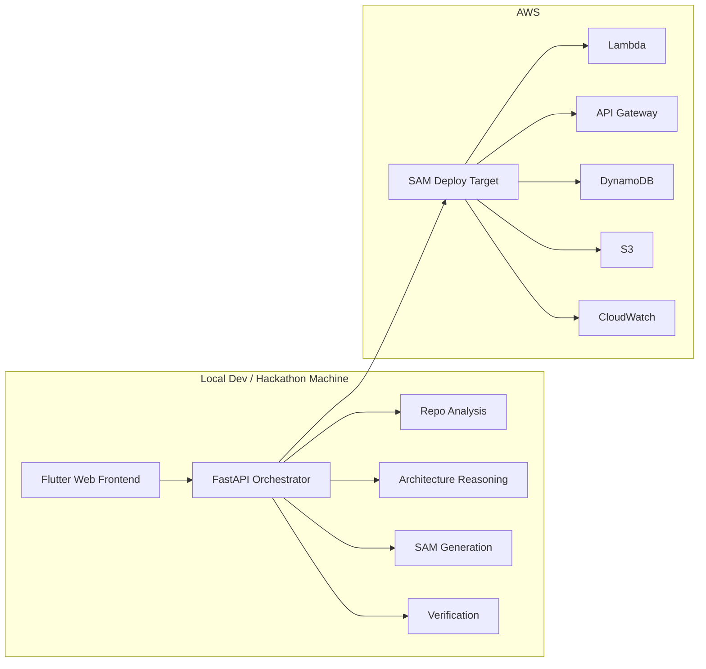

# DeploySamurai Architecture Diagram

## High-Level View

## Optional Runtime Layout

## Connection Rules

- The frontend should talk only to the orchestrator.
- Services should communicate through explicit JSON contracts.
- The orchestrator owns job state and progress updates.
- The analysis service should not deploy anything.
- The reasoning service should not touch AWS directly.
- The generation service should produce files, not execute deployments.
- The deployment service should be the only component that talks to AWS for create/update actions.
- The verification service should validate what was actually deployed, not what was intended.

## Docker Compose Intent

If we have time later, Docker Compose can be used to run the non-AWS parts locally:
- Flutter web dev server
- FastAPI orchestrator
- analysis service
- reasoning service
- SAM generation service
- verification service
- optional local state store

For v1, Docker Compose is a convenience layer, not a requirement.
It should only be added after the service contracts stabilize.
