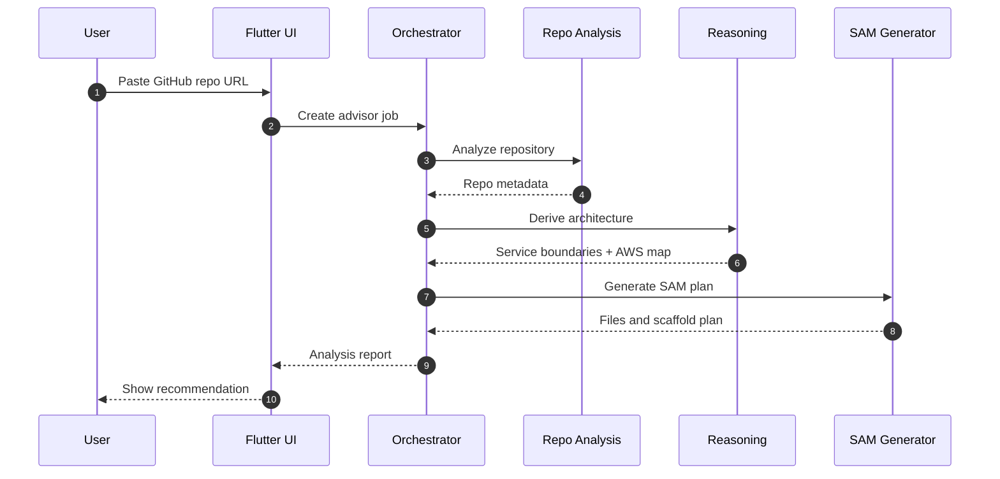
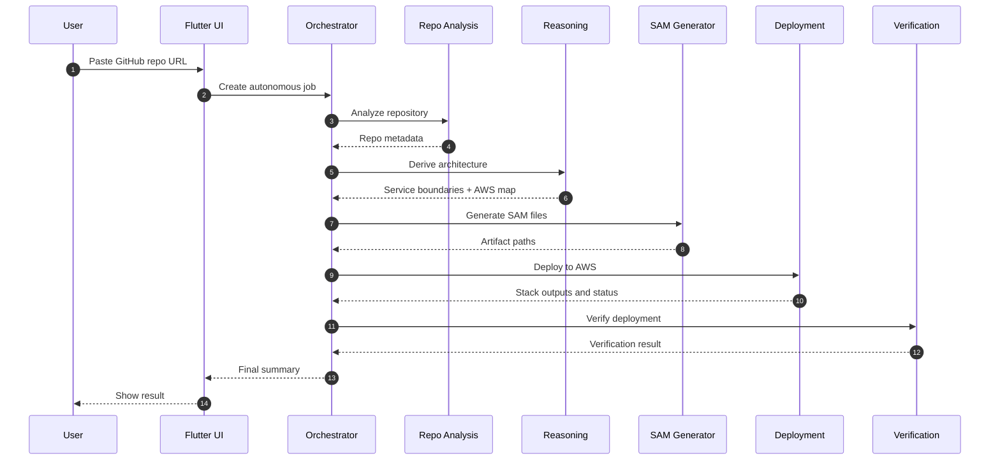

# DeploySamurai Flow Document

## 1. End-To-End Flow

1. User pastes a GitHub repository URL.
2. Frontend validates basic format and mode selection.
3. Frontend sends the request to the FastAPI orchestrator.
4. Orchestrator creates a job record and emits progress.
5. Repo analysis service clones the repository and extracts metadata.
6. Architecture reasoning service evaluates the repo and proposes service boundaries.
7. SAM generation service converts the plan into deployable infrastructure files.
8. If advisor mode is selected, the workflow stops after the recommendation report.
9. If autonomous mode is selected, the deployment service runs SAM build and deploy.
10. Verification service checks the stack and endpoint health.
11. Orchestrator returns the final structured result to the frontend.

## 2. Advisor Mode Flow

## 3. Autonomous Mode Flow

## 4. Internal Service Flow Rules

- Repo analysis runs before reasoning.
- Reasoning runs before generation.
- Generation runs before deployment.
- Verification runs after deployment.
- Progress updates should be emitted after each major step.
- Each service should return structured data, not free-form prose.

## 5. Failure Handling Flow

### Analysis failure
- Mark job failed early.
- Return a precise reason.
- Do not attempt generation or deployment.

### Reasoning failure
- Return the metadata that was extracted.
- Flag the architecture recommendation as unavailable.
- Ask the user to retry or switch to advisor-only output.

### Generation failure
- Preserve analysis and reasoning results.
- Surface the template generation error.
- Do not deploy partial artifacts.

### Deployment failure
- Stop verification.
- Return AWS error details and stack status.
- Keep logs and outputs for debugging.

### Verification failure
- Mark deployment as incomplete.
- Show which check failed.
- Return evidence so the user can inspect the issue.

## 6. Docker Compose Flow

If we add Docker Compose later, the local workflow should be:
1. Start local support services.
2. Start FastAPI orchestrator.
3. Start Flutter frontend.
4. Point the frontend at the local orchestrator.
5. Run advisor mode end to end.
6. Run unit tests and integration tests locally.
7. Use AWS deployment only when credentials and environment are ready.

Compose should not replace AWS deployment.
It should only make development and demos easier.

## 7. Execution Priorities

Build first:
- repository intake
- metadata extraction
- architecture recommendation
- SAM generation

Build next:
- deployment
- verification

Build last:
- Docker Compose local orchestration
- advanced UX polish
- optional service splitting refinements

## 8. Operational Notes

- Keep each service stateless where possible.
- Store job state in one place only.
- Use explicit versioning for request and response payloads.
- Add timeouts to every network or AWS call.
- Prefer retryable, idempotent operations.
- Do not make deployment a prerequisite for advisor mode.
