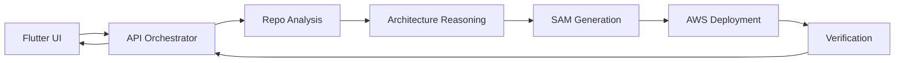

# DeploySamurai Microservice Decomposition and API Contracts

## 1. Suggested Service Split
Keep the first version small and independent:

1. Frontend app
2. API orchestrator
3. Repo analysis service
4. Architecture reasoning service
5. SAM generation service
6. AWS deployment service
7. Verification service

If the team is smaller, combine:
- repo analysis + architecture reasoning
- SAM generation + deployment
- deployment + verification

## 2. Build Order
Recommended order:
1. API orchestrator
2. Repo analysis service
3. Architecture reasoning service
4. SAM generation service
5. Verification service
6. Deployment service
7. Frontend integration

Why this order:
- The orchestrator defines the contracts.
- Analysis and reasoning produce the core value.
- SAM generation is the first concrete artifact.
- Deployment is higher risk and should come after the contracts are stable.

## 3. Service Responsibilities
### Frontend
- collect repo URL and mode
- show progress
- show architecture output
- show generated files
- show deployment result

### API orchestrator
- owns job state
- validates requests
- routes work between services
- emits progress updates
- stores final artifacts

### Repo analysis service
- clones the repo
- detects package manager and language
- inspects folder structure
- finds entry points, tests, and build scripts
- returns normalized metadata

### Architecture reasoning service
- interprets repo metadata
- suggests bounded contexts
- proposes service boundaries
- chooses sync versus async flows
- produces a deployment recommendation

### SAM generation service
- converts architecture into SAM resources
- writes template.yaml
- generates Lambda stubs if needed
- produces deployable artifact metadata

### AWS deployment service
- checks AWS credentials
- runs SAM build and deploy
- captures outputs
- handles stack create/update status

### Verification service
- checks stack status
- confirms endpoint health
- validates expected outputs
- returns pass/fail and evidence

## 4. Data Flow


## 5. API Contracts
All services should use versioned JSON contracts.

### Common envelope
#### Request metadata
```json
{
  "request_id": "string",
  "job_id": "string",
  "correlation_id": "string",
  "timestamp": "ISO-8601 string"
}
```

#### Standard error
```json
{
  "error": {
    "code": "string",
    "message": "string",
    "details": {}
  }
}
```

## 6. Orchestrator API
### `POST /v1/jobs`
Create a new analysis or deployment job.

Request:
```json
{
  "repo_url": "https://github.com/org/repo",
  "mode": "advisor",
  "target": "aws-sam",
  "allow_deploy": false
}
```

Response:
```json
{
  "job_id": "job_123",
  "status": "queued",
  "mode": "advisor"
}
```

### `GET /v1/jobs/{job_id}`
Return current job state.

Response:
```json
{
  "job_id": "job_123",
  "status": "running",
  "current_step": "analyzing_repo",
  "progress": 42
}
```

### `GET /v1/jobs/{job_id}/events`
Stream live progress over SSE or WebSocket.

Event shape:
```json
{
  "job_id": "job_123",
  "step": "stack_detection",
  "status": "running",
  "message": "Detected Python FastAPI project"
}
```

## 7. Repo Analysis API
### `POST /v1/analyze/repo`
Request:
```json
{
  "repo_url": "https://github.com/org/repo",
  "job_id": "job_123"
}
```

Response:
```json
{
  "repo_summary": {
    "name": "repo",
    "default_branch": "main",
    "language": "python",
    "framework": "fastapi",
    "package_manager": "uv",
    "has_tests": true
  },
  "structure": {
    "root_files": ["pyproject.toml", "README.md"],
    "entrypoints": ["app/main.py"]
  }
}
```

## 8. Architecture Reasoning API
### `POST /v1/reason/architecture`
Request:
```json
{
  "job_id": "job_123",
  "repo_summary": {},
  "structure": {}
}
```

Response:
```json
{
  "architecture_type": "microservices",
  "service_candidates": [
    {
      "name": "auth",
      "responsibility": "authentication and session management",
      "runtime": "lambda",
      "data_store": "dynamodb"
    }
  ],
  "communication_flows": [
    {
      "from": "api",
      "to": "auth",
      "style": "sync",
      "transport": "api_gateway"
    }
  ],
  "notes": [
    "Keep the first version to 3 to 5 services."
  ]
}
```

## 9. SAM Generation API
### `POST /v1/generate/sam`
Request:
```json
{
  "job_id": "job_123",
  "architecture": {},
  "output_format": "sam"
}
```

Response:
```json
{
  "files": [
    {
      "path": "template.yaml",
      "content_type": "text/yaml"
    }
  ],
  "artifacts": {
    "template_path": "artifacts/template.yaml"
  }
}
```

## 10. Deployment API
### `POST /v1/deploy`
Request:
```json
{
  "job_id": "job_123",
  "artifact_path": "artifacts/template.yaml",
  "confirm_deploy": true
}
```

Response:
```json
{
  "deployment_id": "dep_456",
  "status": "in_progress"
}
```

### Deployment result
```json
{
  "deployment_id": "dep_456",
  "status": "succeeded",
  "stack_name": "deploy-samurai-dev",
  "outputs": {
    "ApiUrl": "https://example.execute-api.us-east-1.amazonaws.com"
  }
}
```

## 11. Verification API
### `POST /v1/verify`
Request:
```json
{
  "job_id": "job_123",
  "deployment_id": "dep_456",
  "expected_endpoints": ["/health"]
}
```

Response:
```json
{
  "status": "passed",
  "checks": [
    {
      "name": "stack_status",
      "status": "passed"
    },
    {
      "name": "health_endpoint",
      "status": "passed"
    }
  ]
}
```

## 12. Compatibility Rules
- Use stable response fields.
- Never rename core keys without bumping the API version.
- Treat service outputs as contracts, not suggestions.
- Keep models backward compatible where possible.
- Validate each downstream payload before forwarding it.

## 13. First Build Recommendation
Build these first:
- orchestrator
- repo analysis
- architecture reasoning

Delay these until the contracts are proven:
- deployment
- verification

Reason:
- the first three unlock the product story.
- deployment adds the most operational risk.
