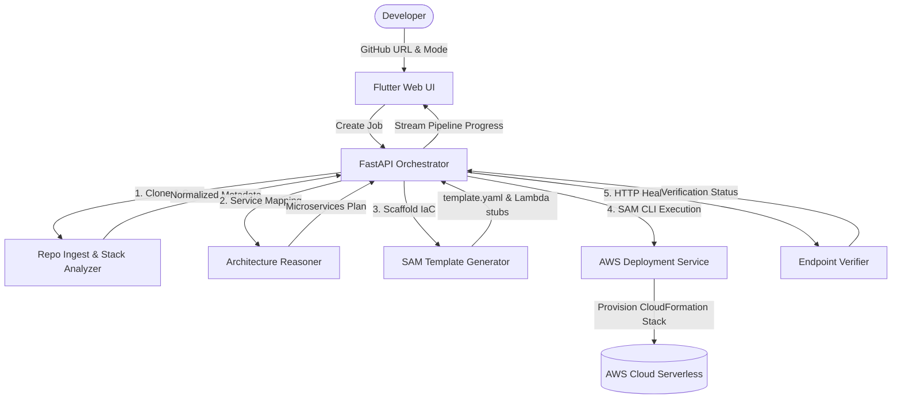

# DeploySamurai ⚔️

DeploySamurai is an AI-assisted AWS serverless architect for GitHub repositories. It clones and analyzes public or authorized GitHub repositories, automatically detects their language stacks/frameworks, proposes microservice boundaries, generates deployable AWS SAM (Serverless Application Model) infrastructure scaffolding, and can optionally deploy and verify the stack directly in AWS.

---

## ❓ The Problem

Transitioning an existing application (e.g., a Python FastAPI or Express.js backend) into a cloud-native serverless architecture on AWS is complex. Developers typically face the following friction points:
* **Manual Service Boundary Analysis:** Determining how to split a repository into distinct Lambda functions, DynamoDB tables, and event flows requires significant domain expertise.
* **Complex Infrastructure-as-Code (IaC):** Writing boilerplate AWS SAM/CloudFormation templates from scratch is time-consuming and error-prone.
* **Deployment & Smoke Testing Friction:** Setting up credentials, deploying stacks, and verifying endpoints in a repeatable manner involves writing custom scripts.

## 💡 The Solution (Idea)

**DeploySamurai** acts as an automated AWS Serverless Architect that turns a repository into a live, secure, and validated cloud application:
* **Instant Architectural Advisory:** It provides automatic stack detection and service decomposition proposals for a target GitHub URL.
* **Deterministic + AI Hybrid Reasoning:** It combines rule-based directory parsing with LLM reasoning to map optimal database, queue, and API gateway resources.
* **Gated Autonomous Deployment:** It scaffold templates, checks AWS credentials, builds and deploys using AWS SAM, and performs live smoke verification.

## ⚙️ How It Works (Technical Implementation)

DeploySamurai orchestrates the pipeline across five primary stages:
1. **Intake & Scanning:** A safe workspace cloner downloads the target GitHub URL and scans project files (e.g., `pyproject.toml`, `package.json`, `requirements.txt`) to extract structure, frameworks, entrypoints, and package managers.
2. **Service Boundary Parsing:** Heuristic algorithms and LLM prompts analyze code complexity and candidate services to propose service boundaries, communication pathways, and persistence stores.
3. **IaC Generation:** A generation engine outputs a ready-to-run AWS SAM `template.yaml` mapping resources like `AWS::Serverless::Function`, `AWS::DynamoDB::Table`, and `AWS::Serverless::HttpApi`, and creates basic Lambda stubs when new entrypoints are required.
4. **AWS SAM CLI Wrapper:** The deployment runner checks local AWS profiles, runs `sam build`, compiles dependencies, and executes `sam deploy` to provision CloudFormation resources.
5. **Endpoint Smoke Verification:** A validation runner sends HTTP verification probes to the deployed API endpoints, verifying status codes and logging telemetry evidence.

---

## 🚀 Operation Modes

DeploySamurai operates in two modes:

1. **Advisor Mode (Low-Risk/Default):**
   * Input: A valid GitHub repository URL.
   * Steps: Clones the repo, runs stack detection, proposes service boundaries and AWS resource maps, and generates a SAM deployment plan without provisioning AWS resources.
   * Outcome: Returns a comprehensive architecture recommendation and SAM template artifacts.
2. **Autonomous Mode (Deployment Gated):**
   * Input: A valid GitHub repository URL.
   * Steps: Runs Advisor Mode steps, waits for explicit user approval, creates/validates AWS CLI credentials, writes SAM files, builds, deploys (`sam build` & `sam deploy`), and runs end-to-end endpoint verification.
   * Outcome: A live, verified serverless infrastructure stack running on AWS, reporting output URLs and logs.

---

## 🛠️ Technology Stack

* **Backend:** FastAPI (Python 3.12)
* **Package/Runtime Manager:** `uv` for lightning-fast workspace initialization and lockfile management.
* **Orchestrator:** Stateful pipelines modeling execution flow using explicit JSON API contracts.
* **Database:** PostgreSQL (persistence of jobs, status, progress metadata)
* **Migrations:** Alembic for DB versioning.
* **IaC Target:** AWS SAM (`template.yaml` and Lambda stubs generation).
* **AWS SDK:** `boto3` and AWS CLI / SAM CLI integrations.
* **Frontend:** Flutter Web dashboard (`apps/frontend/deploysamourai`).

---

## 📂 Project Layout

The repository is structured as a mono-repo combining the FastAPI backend, the Flutter web frontend, database migrations, and project documentation:

```text
├── .codex/                   # Project working memory (specifications, contracts, plans)
│   ├── README.md             # Index of context documents
│   ├── project-plan.md       # Product phases, constraints, and success criteria
│   ├── technical-document.md # Code quality standards, testing strategies, security rules
│   ├── microservice-plan.md  # Detailed API endpoint definitions & splits
│   ├── architecture-diagram.md# Mermaid representations of data flow and architecture
│   ├── flow-document.md      # Execution pipelines and error handling logic
│   └── todo.md               # Task list and development tracking
├── alembic/                  # Alembic configuration & database migrations
├── apps/
│   └── frontend/
│       └── deploysamourai/   # Flutter Web dashboard app
├── artifacts/                # Output storage for templates, logs, and Lambda stubs
├── src/
│   └── deploy_samurai/       # FastAPI Backend codebase
│       ├── api/              # Route routers and endpoints
│       │   └── routes/       # Route files (jobs, analysis, reasoning, sam, deploy, verify)
│       ├── core/             # Application configuration and settings (Pydantic-based)
│       ├── db/               # SQLAlchemy models registration and session management
│       ├── models/           # DB tables (e.g. Job status, type schema)
│       ├── schemas/          # Versioned request & response Pydantic models (API Contracts)
│       └── services/         # Modular orchestrator & downstream domain services
│           ├── architecture_reasoning/ # LLM Boundary mapping & candidate reasoning
│           ├── deployment/   # AWS SAM Build & Deploy subprocess executors
│           ├── repo_analysis/# Workspace cloner, folder parser, stack detection rules
│           ├── sam_generation/# Template renderer & stub generator
│           └── verification/ # Stack status checks & API endpoint smoke tester
├── tests/                    # Extensively tested codebase
│   ├── unit/                 # Unit tests for all modules
│   ├── integration/          # Core integration flows
│   └── contracts/            # Payload & contract compliance tests
├── pyproject.toml            # Backend dependencies configuration
└── docker-compose.yml        # Multi-service support runner (e.g., PostgreSQL database)
```

---

## ⚙️ Environment Variables

Copy the example configuration to initialize your local environment:
```powershell
cp .env.example .env
```

| Variable | Default Value | Description |
| :--- | :--- | :--- |
| `APP_ENV` | `local` | Application context environment (`local` enables API reload). |
| `APP_NAME` | `DeploySamurai` | The title used for API metadata. |
| `API_HOST` | `127.0.0.1` | Host address of the FastAPI server. |
| `API_PORT` | `8000` | Port running the FastAPI server. |
| `DATABASE_URL` | `postgresql+asyncpg://...` | Asynchronous SQLAlchemy connection string for PostgreSQL. |
| `REPO_WORKSPACE_ROOT`| `.workspaces/repos` | Path where target Git repositories are cloned for analysis. |
| `ARTIFACT_ROOT` | `artifacts` | Directory where generated SAM templates & stubs are stored. |
| `AWS_REGION` | `us-east-1` | Target region for deploying the AWS SAM CloudFormation stack. |
| `CORS_ALLOW_ORIGINS` | `http://localhost:3000,...` | List of allowed CORS origins for client applications. |
| `OPENAI_API_KEY` | `""` | Optional API key for OpenAI GPT execution inside the reasoning layer. |
| `OPENAI_MODEL` | `""` | Custom OpenAI GPT model identifier. |

---

## 🏎️ Running Locally

### 1. Backend Setup

Prerequisites: Ensure you have `uv` installed. If you do not have it, install it using standard scripts or `pip install uv`.

1. **Synchronize Dependencies:**
   ```powershell
   uv sync --dev
   ```

2. **Boot the Local Database:**
   DeploySamurai persists jobs and step logs to PostgreSQL. Start the database container:
   ```powershell
   docker compose up -d postgres
   ```

3. **Execute DB Migrations:**
   Ensure database schemas are initialized:
   ```powershell
   uv run alembic upgrade head
   ```

4. **Start the FastAPI Server:**
   ```powershell
   uv run uvicorn deploy_samurai.main:app --reload --host 127.0.0.1 --port 8000
   ```
   * The interactive API docs will be available at [http://127.0.0.1:8000/docs](http://127.0.0.1:8000/docs)
   * Check api health: `curl http://127.0.0.1:8000/v1/health`

### 2. Frontend Setup

1. **Navigate to the Flutter directory:**
   ```powershell
   cd apps/frontend/deploysamourai
   ```

2. **Retrieve Flutter Packages:**
   ```powershell
   flutter pub get
   ```

3. **Start the Frontend Web Dashboard:**
   Pass the target API URL using the `--dart-define` flag so Flutter can reach the backend:
   ```powershell
   flutter run -d chrome --web-port 8077 --dart-define=API_BASE_URL=http://127.0.0.1:8000/v1
   ```

---

## 📡 API Reference & Contracts

All requests and responses use strict JSON schemas validated via Pydantic models.

### 1. Job Orchestration

#### `POST /v1/jobs`
Creates a new analysis/deployment job.
* **Request Payload (`JobCreateRequest`):**
  ```json
  {
    "repo_url": "https://github.com/the-shreyashmaurya/DeploySamurai",
    "mode": "advisor",
    "target": "aws-sam",
    "allow_deploy": false
  }
  ```
  > [!NOTE]
  > Gating check: Selecting `mode = "autonomous"` requires `allow_deploy = true`.
* **Response Payload (`JobCreateResponse`):**
  ```json
  {
    "job_id": "job_d9804e4cb314",
    "status": "queued",
    "mode": "advisor"
  }
  ```

#### `GET /v1/jobs/{job_id}`
Returns the current execution state and progress of the specified job.
* **Response Payload (`JobReadResponse`):**
  ```json
  {
    "job_id": "job_d9804e4cb314",
    "status": "running",
    "current_step": "stack_detection",
    "progress": 42
  }
  ```

---

### 2. Service Micro-steps (Internal / Advanced APIs)

#### `POST /v1/analyze/repo`
Triggers direct repo ingestion, workspace cloning, and file scanning.
* **Request:**
  ```json
  {
    "repo_url": "https://github.com/the-shreyashmaurya/DeploySamurai",
    "job_id": "job_d9804e4cb314"
  }
  ```
* **Response:** Returns `RepoSummary` (classification data) and `RepoStructure` (tree layout).

#### `POST /v1/reason/architecture`
Executes service boundaries parsing and maps data stores to candidates.
* **Request:** Payload contains the `job_id`, `repo_summary`, and `structure` generated by the analysis step.
* **Response (`ArchitectureReasoningResponse`):**
  ```json
  {
    "architecture_type": "microservices",
    "summary": "Decomposing into user and catalog Lambda handlers.",
    "service_candidates": [
      {
        "name": "catalog",
        "responsibility": "Product listing API",
        "runtime": "lambda",
        "data_store": "dynamodb"
      }
    ],
    "communication_flows": [
      {
        "from": "api-gateway",
        "to": "catalog",
        "style": "sync",
        "transport": "api_gateway"
      }
    ],
    "notes": []
  }
  ```

#### `POST /v1/sam/generate`
Generates the AWS SAM `template.yaml` and places Lambda handlers stubs into the output folder.
* **Request:** Payload contains `job_id` and the `architecture` plan.
* **Response:** Generates artifacts paths and files list.
* **Download endpoint:** `GET /v1/sam/artifacts/{job_id}/template.yaml` retrieves the generated SAM template directly.

#### `POST /v1/deploy/preflight`
Verifies that AWS credentials and environment variables are present and correct before launching deployment.
* **Response:** Reports `status` (`passed` or `failed`), region, account ID, and credential ARN.

#### `POST /v1/deploy/sam`
Invokes the AWS SAM CLI to build and deploy the stack.
* **Request:**
  ```json
  {
    "job_id": "job_d9804e4cb314",
    "artifact_path": "artifacts/job_d9804e4cb314/template.yaml",
    "confirm_deploy": true,
    "stack_name": "my-custom-stack-dev"
  }
  ```
* **Response:** Output paths and stack endpoints list.

#### `POST /v1/verify`
Performs end-to-end integration and smoke verification check of the deployed AWS stack.
* **Request:** Payload contains `job_id`, `deployment_id`, and `expected_endpoints` to test.
* **Response:** Verification pass/fail status and evidence list.

---

## 🧪 Testing & Code Quality

Maintain code cleanliness by running automated linting and execution checks from the project root:

```powershell
# Auto-format Python files
uv run ruff format .

# Static analysis and lint checks
uv run ruff check .

# Execute the test suite (Unit, integration, and contracts)
uv run pytest
```

---

## 🧩 Architectural Design



---

## 📝 Working Guidelines

1. **Context Synchronization:** Always consult the files in `.codex` when proposing features or changing interfaces.
2. **Contracts Lock:** Keep request and response schemas backward-compatible. Tests under `tests/contracts` guard these integrations.
3. **Small Iterations:** Keep changes simple, testable, and deterministic. Avoid adding AWS features without corresponding tests.
