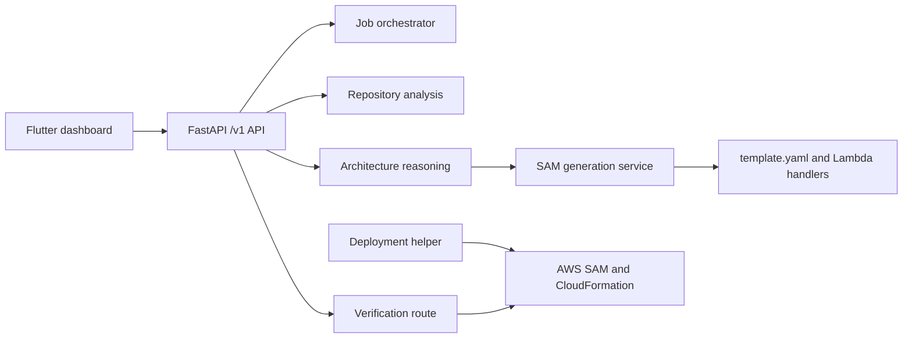
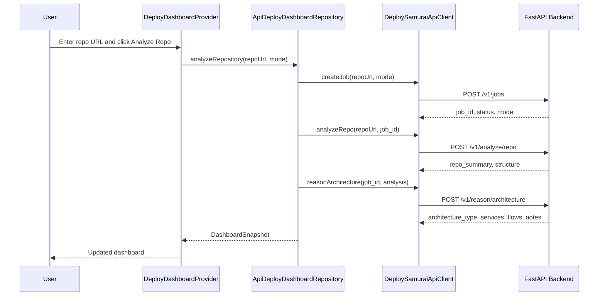

# DeploySamurai Technical Document

This document explains the current code flow after merging Phase 4 deployment helpers and Phase 5 verification into the frontend branch.

## Repository State

- Current working branch: `codex/deploysamurai-flutter-ui`
- Integrated remote history: `origin/dev`, which currently matches `origin/codex/phase-5-verification`
- Phase 4 added AWS credential preflight and SAM CLI deployment helpers.
- Phase 5 added verification contracts, service logic, tests, and `POST /v1/verify`.
- The Flutter frontend is integrated with the live backend for job creation, repository analysis, and architecture reasoning.

## System Overview

DeploySamurai is split into a FastAPI backend and a Flutter web dashboard.



The current HTTP surface exposes analysis and verification primitives, but the full deploy path is not yet orchestrated behind public routes.

## Backend Stack

- FastAPI application entrypoint: `src/deploy_samurai/main.py`
- API router: `src/deploy_samurai/api/router.py`
- Settings: `src/deploy_samurai/core/config.py`
- Database: PostgreSQL through SQLAlchemy async sessions
- Migrations: Alembic
- Package/runtime management: `uv`
- Repository analysis: local `git clone` plus metadata heuristics
- Architecture reasoning: deterministic heuristics with optional OpenAI summary provider
- SAM generation: YAML template rendering plus Lambda scaffold files
- Deployment: AWS credentials, SAM CLI, CloudFormation outputs
- Verification: CloudFormation stack status and HTTP endpoint smoke checks

## Frontend Stack

- Flutter web app root: `apps/frontend/deploysamourai`
- App bootstrap: `lib/main.dart`
- App shell/theme: `lib/presentation/app/deploy_samurai_app.dart`
- API base URL config: `lib/core/config/api_config.dart`
- API client: `lib/data/api/deploy_samurai_api_client.dart`
- Repository abstraction: `lib/domain/repositories/deploy_dashboard_repository.dart`
- Live repository implementation: `lib/data/repositories/api_deploy_dashboard_repository.dart`
- Dashboard state provider: `lib/presentation/providers/deploy_dashboard_provider.dart`
- Main page: `lib/presentation/pages/dashboard_page.dart`
- Panels/widgets: `lib/presentation/widgets`

## Configuration

Backend settings are loaded from `.env` through Pydantic settings:

| Setting | Default | Purpose |
| --- | --- | --- |
| `APP_ENV` | `local` | Enables reload in local mode |
| `API_HOST` | `127.0.0.1` | Uvicorn host |
| `API_PORT` | `8000` | Uvicorn port |
| `DATABASE_URL` | local PostgreSQL URL | Async SQLAlchemy database |
| `REPO_WORKSPACE_ROOT` | `.workspaces/repos` | Temporary cloned repository root |
| `ARTIFACT_ROOT` | `artifacts` | Generated artifact root |
| `AWS_REGION` | `us-east-1` | AWS session region |
| `CORS_ALLOW_ORIGINS` | local frontend origins | Browser access control |
| `OPENAI_API_KEY` | unset | Optional LLM summary provider |
| `OPENAI_MODEL` | unset | Optional model override |

Frontend API URL:

```powershell
flutter run -d chrome --web-port 8077 --dart-define=API_BASE_URL=http://127.0.0.1:8000/v1
```

If `API_BASE_URL` is not provided, it defaults to `http://127.0.0.1:8000/v1`.

## API Surface

| Method | Path | Status |
| --- | --- | --- |
| `GET` | `/v1/health` | Backend health |
| `POST` | `/v1/jobs` | Creates job row and returns job id |
| `GET` | `/v1/jobs/{job_id}` | Reads persisted job status |
| `POST` | `/v1/analyze/repo` | Clones and analyzes a GitHub repository |
| `POST` | `/v1/reason/architecture` | Produces architecture recommendation |
| `POST` | `/v1/verify` | Runs verification workflow |

Not currently exposed as HTTP routes:

- SAM generation from `services/sam_generation/template.py`
- AWS credential preflight from `services/deployment/preflight.py`
- SAM build/deploy from `services/deployment/sam_cli.py`

## Current Frontend Runtime Flow



The frontend does not currently poll `GET /v1/jobs/{job_id}`. The provider treats the three backend calls as one synchronous analysis action and updates the dashboard when the chain finishes.

## Backend Flow Details

### Job Creation

`POST /v1/jobs` validates `JobCreateRequest`.

- `repo_url` must be a GitHub URL.
- `mode` defaults to `advisor`.
- `target` defaults to `aws-sam`.
- `allow_deploy` defaults to false.
- `autonomous` mode requires `allow_deploy=true`.

`JobOrchestrator.create_job` writes a `Job` row with default status `queued`, current step `queued`, and progress `0`.

### Repository Analysis

`POST /v1/analyze/repo` calls `analyze_repository`.

1. Parse and validate GitHub repo URL.
2. Resolve a safe workspace path under `REPO_WORKSPACE_ROOT`.
3. Remove any existing workspace for the same job/repo.
4. Run `git clone --depth 1 --single-branch`.
5. Extract root files and visible folder tree.
6. Detect language, framework, package manager, tests, and entrypoints.
7. Return `RepoAnalysisResponse`.

### Architecture Reasoning

`POST /v1/reason/architecture` calls `reason_about_architecture`.

1. Normalize analysis metadata into known language/framework/package-manager values.
2. Infer service candidates from framework, folders, and entrypoints.
3. Infer sync or async communication flows.
4. Decide `modular_monolith` or `microservices`.
5. Build deterministic summary and notes.
6. Optionally replace summary through the OpenAI provider when configured.

### SAM Generation

`generate_sam_template` is an internal service function.

Inputs:

- `job_id`
- `ArchitectureReasoningResponse`
- output root

Outputs:

- `template.yaml`
- Lambda handler scaffold files under `src/{service}/app.py`
- resource summaries
- handler metadata

Resource mapping:

- Always emits `AWS::Serverless::HttpApi`.
- Lambda service candidates become `AWS::Serverless::Function`.
- DynamoDB data stores add `AWS::DynamoDB::Table`.
- SQS flows add `AWS::SQS::Queue` and poller policies.
- EventBridge flows add `AWS::Events::Rule`.
- Static frontend candidates become `AWS::S3::Bucket`.

### Deployment

Phase 4 added deployment helpers, but no HTTP route currently calls them.

`check_aws_credentials`:

- Creates a boto3 session when one is not injected.
- Uses configured `AWS_REGION`.
- Checks credentials availability.
- Optionally calls STS `get_caller_identity`.
- Returns structured pass/fail detail with account and ARN when available.

`execute_sam_build_and_deploy`:

- Requires `confirm_deploy=true`.
- Requires the SAM template path to exist.
- Runs `sam build --template-file <template>`.
- Runs `sam deploy --stack-name <stack> --no-confirm-changeset --no-fail-on-empty-changeset --capabilities CAPABILITY_IAM`.
- Retries build/deploy commands with configurable attempt count.
- Reads CloudFormation outputs through `aws cloudformation describe-stacks`.
- Returns `DeploymentResult` with deployment id, stack name, outputs, and command logs.

### Verification

Phase 5 added a verification route and services.

`POST /v1/verify` accepts:

- `job_id`
- `deployment_id`
- optional `stack_name`
- optional `base_url`
- `expected_endpoints`

`run_verification` produces checks:

- `stack_status`: uses a CloudFormation client when one is injected.
- `endpoint_smoke:{path}`: sends GET requests against `base_url` plus each expected endpoint.

Important current behavior:

- The HTTP route calls `run_verification(payload)` without injecting a CloudFormation client, so stack status is skipped from the route-level path for now.
- Endpoint smoke checks do run from the route when `base_url` is provided.
- If `base_url` is missing but expected endpoints are provided, endpoint checks are skipped.
- Overall verification status is `failed` if any check fails, otherwise `passed`.

## Dashboard Snapshot Mapping

The Flutter dashboard uses one aggregate entity: `DashboardSnapshot`.

It includes:

- job id
- repo URL
- selected analysis mode
- region and version labels
- connection state
- run status
- elapsed label
- status message
- pipeline steps
- architecture resources and connections
- stack facts
- artifacts
- console logs
- SAM plan summary
- architecture summary
- notes

The mapper functions create three important states:

| Mapper | Purpose |
| --- | --- |
| `buildInitialDashboardSnapshot` | Idle dashboard before backend calls |
| `buildRunningDashboardSnapshot` | Optimistic running state before API chain |
| `buildAnalyzedDashboardSnapshot` | Successful state after architecture reasoning |
| `buildFailedDashboardSnapshot` | Failed state with friendly API error |

## Current Limitations

- Job status is persisted but not updated beyond initial `queued` by orchestration.
- The frontend does not use job polling or streaming events.
- SAM generation is not exposed through a route.
- Deployment is not exposed through a route.
- Verification is exposed, but not called from the frontend.
- Route-level verification does not instantiate a CloudFormation client, so stack status checks are skipped there.
- Artifact download, SAM plan review, approval, deploy, navigation, console pause, and clear actions are placeholders.
- The frontend shows only up to four architecture resources and four connections.

## Recommended Next Integration Steps

1. Add a SAM generation route that wraps `generate_sam_template`.
2. Persist generated artifact metadata against a job.
3. Add a deployment route that performs credential preflight and then calls the SAM deploy helper.
4. Add backend job status transitions for each major phase.
5. Add frontend polling or server-sent events for live progress.
6. Wire the approval gate to a real SAM plan detail view.
7. Call `POST /v1/verify` after deployment and show check evidence in the dashboard.
8. Inject or construct a CloudFormation client in the verification route when `stack_name` is provided.

## Local Validation Commands

Backend:

```powershell
uv sync --dev
uv run alembic upgrade head
uv run ruff format --check .
uv run ruff check .
uv run pytest
uv run uvicorn deploy_samurai.main:app --reload --host 127.0.0.1 --port 8000
```

Frontend:

```powershell
cd apps/frontend/deploysamourai
flutter test
flutter run -d chrome --web-port 8077 --dart-define=API_BASE_URL=http://127.0.0.1:8000/v1
```
