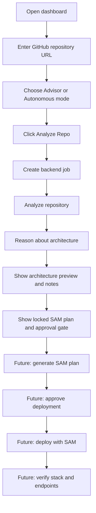

# DeploySamurai User Flow

This document describes the current product flow after integrating the Phase 4 deployment helpers and Phase 5 verification service into the frontend branch.

The current Flutter UI supports the advisor journey through job creation, repository analysis, and architecture reasoning. SAM generation, deployment, and verification capabilities exist in backend services, but the frontend still keeps those actions gated or disabled until dedicated API/UI wiring is added.

## Primary User

A developer or hackathon judge wants to understand how a GitHub repository could be mapped into an AWS SAM serverless architecture before allowing any deployment action.

## Current Happy Path

1. The user opens the DeploySamurai dashboard.
2. The dashboard loads an initial snapshot with an example repository URL, idle status, empty architecture preview, empty artifact list, and an offline connection indicator.
3. The user enters or confirms a GitHub repository URL.
4. The user selects an analysis mode:
   - Advisor mode: recommendations and architecture guidance.
   - Autonomous mode: selectable in UI, but deployment remains approval-gated.
5. The user clicks `Analyze Repo`.
6. The frontend creates a backend job with `POST /v1/jobs`.
7. The frontend requests repository analysis with `POST /v1/analyze/repo`.
8. The backend clones the GitHub repository into the configured workspace and extracts metadata:
   - repository name
   - language
   - framework
   - package manager
   - test presence
   - root files
   - folder paths
   - detected entrypoints
9. The frontend sends the analysis result to `POST /v1/reason/architecture`.
10. The backend infers service boundaries, decides whether the repository should be treated as a modular monolith or microservices, and returns architecture notes.
11. The dashboard updates to succeeded:
   - pipeline marks Intake, Clone, Detect Stack, and Boundaries as completed
   - SAM Plan and Approval remain locked
   - Deploy and Verify remain pending
   - architecture preview displays up to four inferred service resources
   - stack facts show detected stack, runtime, region, and component count
   - console logs show backend call progress
   - approval panel explains that deployment requires reviewing the SAM plan

## User Flow Diagram

## Screen-Level Flow

### Dashboard Header

The header shows the product identity, configured AWS region, app version, and connection status. The connection indicator becomes `Connected` after the frontend receives backend-backed data and becomes `Offline` on API failure.

### Repository Panel

The repository panel is the entry point for the user. It includes:

- GitHub repository URL input
- clear-input action
- `Analyze Repo` button
- current run status message
- Advisor and Autonomous mode selector
- guardrail copy explaining that autonomous deployment requires approval

When analysis is running, the button is disabled and displays a spinner.

### Pipeline Panel

The pipeline represents the intended end-to-end lifecycle:

1. Intake
2. Clone
3. Detect Stack
4. Boundaries
5. SAM Plan
6. Approval
7. Deploy
8. Verify

In the current frontend implementation, only the first four steps can complete from live backend calls. SAM Plan and Approval are locked because no SAM generation route is exposed to the UI yet.

### Architecture Preview

The architecture preview maps backend `service_candidates` and `communication_flows` into visual cards and connector lines. The UI supports these resource types:

- API Gateway
- Lambda
- SQS-style async/worker resource
- DynamoDB-style data resource

If the backend returns more than four service candidates, the preview shows only the first four.

### Approval Gate

The approval gate is visible but not actionable for deployment yet. It shows the current SAM plan summary and disables `Approve & Deploy`. The review button exists visually but is not wired to a plan detail view.

### SAM Artifacts

The artifact panel is prepared to show generated files such as `template.yaml` and Lambda handlers. In the current live flow, it remains empty because SAM generation is backend service code only and not exposed to the frontend through an API route.

### Deployment Console

The console shows frontend-generated status logs for the live API calls. It does not stream backend logs yet.

## Failure Flows

### Invalid Repository URL

If the repository URL is not a valid GitHub URL, `POST /v1/jobs` returns a validation error. The dashboard moves to failed state and shows the backend error.

### Backend Unavailable

If FastAPI is not running at `API_BASE_URL`, the dashboard shows an offline error telling the user to check the API URL.

### Clone or Analysis Failure

If `git clone` fails or repository analysis raises a safe validation error, the backend returns an error and the dashboard records it in the console.

### Reasoning Failure

If architecture reasoning fails, the repository has already been accepted and analyzed, but the dashboard still ends in failed state because the frontend treats the full advisor chain as one analysis run.

### Future Deployment Failure

The Phase 4 backend deployment helper can fail before deployment if:

- `confirm_deploy` is false
- the SAM template path does not exist
- AWS credentials are missing or invalid
- `sam build` fails
- `sam deploy` fails after retry attempts

### Future Verification Failure

The Phase 5 verification service can fail checks when:

- the CloudFormation stack is missing or not in an accepted status
- an expected endpoint returns a non-2xx/3xx status
- an endpoint request errors

Checks can also be skipped when required inputs are not available.

## Guardrails

- Autonomous jobs require explicit deploy intent in backend validation.
- Deployment helper requires `confirm_deploy=true`.
- The UI keeps deployment disabled until a SAM plan exists and approval is wired.
- Verification reports structured checks and evidence instead of relying on free-form text.

## Current UX Gaps

- No live job polling or event stream is used after `POST /v1/jobs`.
- `GET /v1/jobs/{job_id}` is available but not used by the frontend.
- SAM generation has service code but no exposed route.
- Deployment has service code but no exposed route.
- Verification has a backend route, but the frontend does not call it yet.
- Approval, review, download, navigation, and console controls are visual placeholders.
